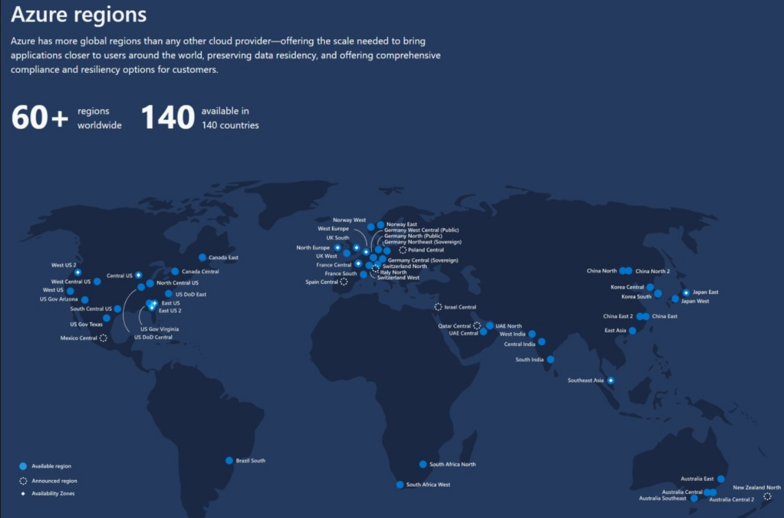
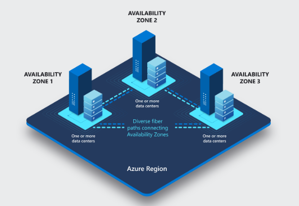
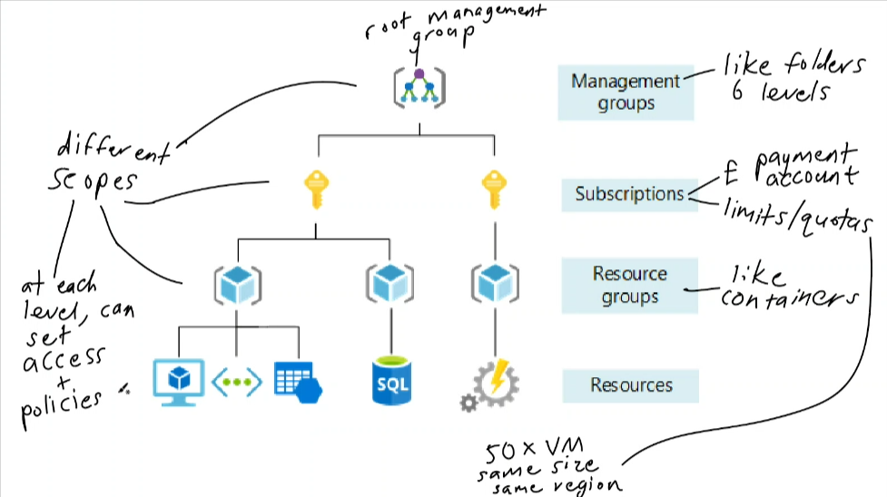

# Understanding Azure Basics

Azure is a cloud computing platform provided by Microsoft, offering a wide range of services for building, deploying, and managing applications and services through Microsoft-managed data centers.

## What is Azure?

Azure provides a variety of cloud services, including computing power, storage, and networking, enabling businesses to build, deploy, and manage applications and services without the need to invest in physical infrastructure.

## Azure Regions and Availability Zones

- **Azure Regions**: Geographical areas containing data centers where Azure resources are hosted. Each region is independent and consists of one or more data centers.
  
  

- **Availability Zones**: Physically separate data centers within an Azure region, designed to provide high availability and fault tolerance. Each availability zone is equipped with independent power, cooling, and networking.

  

## Azure Structure/Organization

Azure organizes resources into logical groupings called resource groups. Resource groups contain related resources, such as virtual machines, databases, and storage accounts, and provide management capabilities, such as access control and billing.
 

## Types/Categories of Azure Services

Azure offers a wide range of services across various categories:
- **Compute**: Provides virtual machines, containers, and serverless computing options.
- **Storage**: Offers scalable storage solutions, including blob storage, file storage, and disk storage.
- **Networking**: Includes virtual networks, load balancers, and VPN gateways for connecting resources.
- **Databases**: Offers managed database services, such as SQL Database, Cosmos DB, and MySQL.
- **AI and Machine Learning**: Provides services for building and deploying AI models and machine learning algorithms.
- **IoT**: Offers services for connecting, monitoring, and managing IoT devices and data.
- **Security**: Includes services for identity management, threat protection, and security monitoring.
- **Devops**: For private companies with fine-grained security, includes services for Devops tools and practices such as CI/CD, IAC.

## Azure Pricing Calculator

The Azure Pricing Calculator estimates the cost of Azure services based on your usage and setup. It helps you pick services, adjust usage details, and see how much it might cost you.

### Features:

- **Service Selection**: Choose from a range of Azure services like virtual machines and databases.

- **Usage Parameters**: Adjust settings like region, storage type, and runtime hours to see how they affect costs.

- **Cost Estimation**: Get detailed estimates of how much each service might cost you based on your inputs.

- **Scenario Modeling**: Compare different setups to find the most cost-effective options.

### Example:

Imagine you're building a web app on Azure. You'd pick Azure App Service for hosting, Azure SQL Database for storing data, and Azure Blob Storage for media files. Then, input things like expected traffic, storage needs, and data transfer rates. The calculator will give you a breakdown of monthly costs, helping you plan your budget effectively.

### Comparison with TCO Calculator:

While the Azure Pricing Calculator helps estimate ongoing costs for Azure services, a Total Cost of Ownership (TCO) calculator looks at the entire lifespan and broader costs of IT assets. For example, while the Azure Pricing Calculator helps estimate monthly costs for using Azure services like hosting and storage, a TCO calculator would consider factors like initial hardware and software investments, maintenance costs, and depreciation over time. It provides a more comprehensive view of the financial implications of IT investments beyond just usage costs.

## Personal Notes and Takeaways

- Azure regions and availability zones play a crucial role in ensuring high availability and fault tolerance for applications and services.
- Understanding Azure's structure and organization helps in efficient resource management and access control.
- Azure offers a wide range of services across various categories, providing flexibility and scalability for diverse business needs.
- Utilizing the Azure Pricing Calculator helps in estimating and optimizing Azure spending, ensuring cost-effective usage of cloud resources.