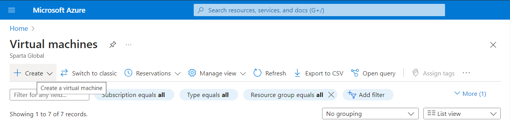
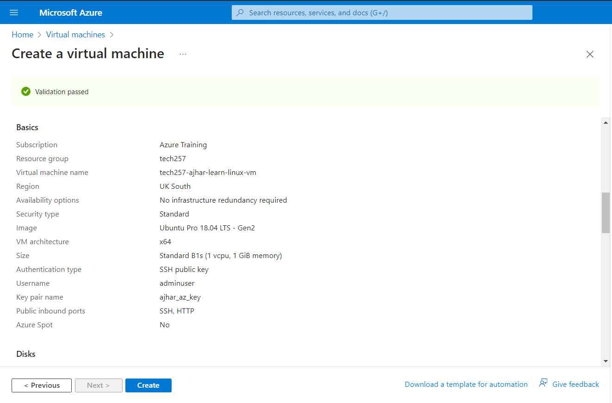
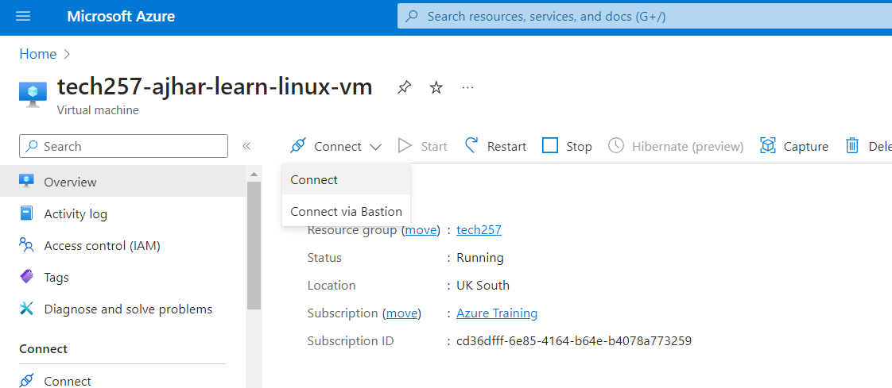
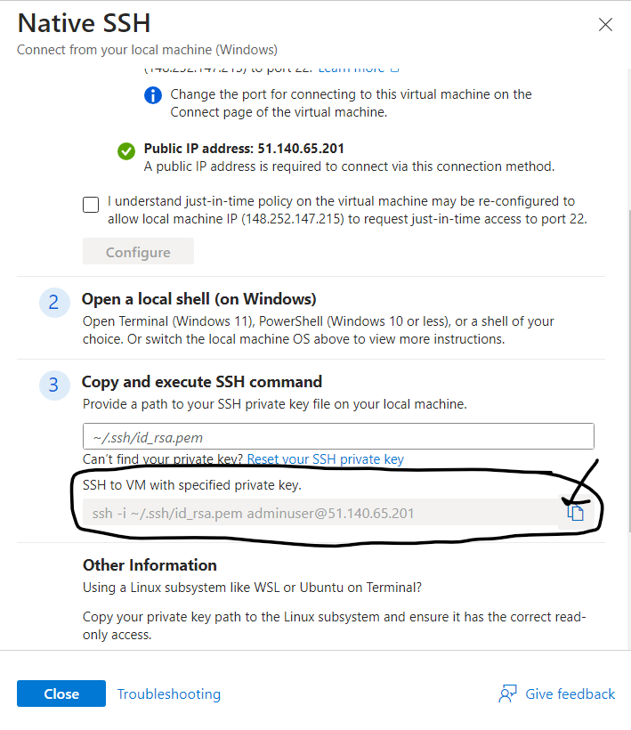
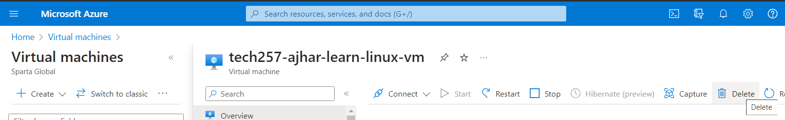

# Azure Setup Guide

## Virtual Machines (VM)

A virtual machine (VM) is like a computer inside your computer. It's a software-based version of a physical computer that runs on your PC or server. Imagine having a computer within your computer that you can use to run different operating systems and software.

## How to Login to Azure
1. Go to [portal.azure.com](https://portal.azure.com).
2. Log in with your Microsoft account.

## Setup SSH Key on Azure
1. Create SSH keys locally using the terminal in the `.ssh/` directory.
2. Generate with `ssh-keygen -t rsa -b 4096 -C "mhussain@spartaglobal.com"`.
3. Choose a suitable name and display the public key in the terminal using `cat`.
4. Copy and paste the public key into Azure portal by searching "Ssh keys" -> "+ Create" -> "Upload existing key".

## How to Create a Virtual Machine (VM)
1. Go to Virtual Machine page and click "+ Create" -> "Azure virtual machine".

2. Fill in name, region, and select appropriate images and instance size for your workload.
3. For the administrator account, select SSH public key and use existing key stored in Azure, making sure to select your own key.
4. Allow inbound ports for SSH (22) and HTTP (80).
5. On the next page, pick appropriate disk size and type.
6. On the next page, pick the correct virtual network and public subnet.
7. Create and allocate tags.
8. Review and click create when ready.

## How to SSH into your VM
1. Click and go into your virtual machine resource in the GUI.
2. Click Connect.

3. Click Native SSH.
4. Provide the path to your SSH keys on your local machine.
5. Now the command to SSH into your VM should be there ready to copy in step 3.

6. Enter this command into the terminal and click yes to whitelist your VM's public IP.
7. Congratulations! You have SSH'ed into your new VM!

## How to Delete a VM
1. Click and go into your virtual machine resource in the GUI.
2. Click Delete and confirm the delete.

