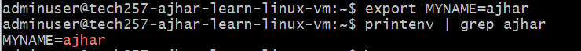
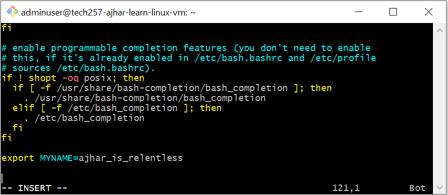
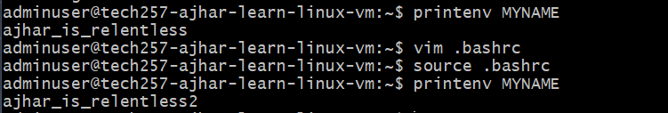

# Linux Basics

Linux is an operating system that powers a wide range of devices, from personal computers to servers and embedded systems. Here are some fundamental concepts and commands to get you started:

## What is Linux?

Linux is an open-source operating system kernel originally developed by Linus Torvalds in 1991. It is based on Unix and provides a powerful and customizable environment for computing.

## Shell and Terminal

In Linux, the shell is a command-line interpreter that allows users to interact with the operating system by typing commands. The terminal is the interface through which the shell operates, providing a text-based environment for running commands.

GitBash, a terminal emulator for Windows, provides a Linux shell environment, enabling users to run Linux commands on a Windows system.

## Why Learn Linux?

- **Open Source**: Linux is open-source software, meaning its source code is freely available for modification and distribution. There are various distributions (distros) tailored for different use-cases, offering flexibility and choice.
- **Remote Communication**: Linux is commonly used to communicate with remote servers and virtual machines (VMs) through secure shell (SSH), enabling remote administration and management.
- **Scripting**: Linux provides powerful scripting capabilities, allowing users to automate tasks, manipulate data, and configure systems through shell scripts.
- **Monitoring**: Linux offers robust monitoring and debugging tools, making it ideal for system administration and performance optimization.

## Common Linux Commands

- **cd**: Changes the current directory. Example: `cd /path/to/directory`.
- **ls**: Lists files and directories in the current directory.
  - `-l`: Displays detailed information about files and directories, including permissions, ownership, size, and modification date. Example: `ls -l`.
  - `-a`: Shows hidden files and directories (those starting with a dot). Example: `ls -a`.
- **tree**: Displays the directory structure in a tree-like format. Example: `tree`.

- **history**: Displays a list of previously executed commands. Use `history -c` to clear the command history. Use `!<number>` to reuse a command from history.
- **curl**: Used to download files or data from the internet. Example: `curl https://example.com/file.txt`.
- **sudo**: Stands for "superuser do." It allows users to execute commands with elevated privileges.
- **apt install/update**: Package management commands used to install or update software packages on Debian-based Linux distributions. Be cautious when upgrading packages (`apt upgrade`), as it may affect the stability of the system.

   - `apt install`: Installs a package. Example: `sudo apt install <package_name>`.
   - `apt update`: Updates the package index to ensure the latest version of packages is available. Example: `sudo apt update`.

   Be careful with `apt upgrade` as upgrading packages may introduce compatibility issues if the server relies on specific package versions.
- **mv**: Moves or renames files and directories. Example: `mv file1.txt directory/`.
- **cp**: Copies files and directories. Example: `cp file1.txt file2.txt`.

- **ps**: Displays information about active processes.
   - `-s $$`: Shows system processes for the current shell session. Example: `ps -s $$`.

- **systemctl**: Manages system services.
   - `status`: Displays the status of a service. Example: `sudo systemctl status nginx`.
   - `stop`: Stops a service. Example: `sudo systemctl stop nginx`.
   - `restart`: Restarts a service. Example: `sudo systemctl restart nginx`.
   - `enable`: Enables a service to start automatically at boot. Example: `sudo systemctl enable nginx`.

- **sudo systemctl is-enabled**: Checks if a service is enabled (returns a boolean).

- **chmod**: Changes file permissions.
  
  ## Variables and environment variables
- **printenv**: Prints environment variables.
- To create a variable: `<define_variable>=<variable_value>`.
  
- To create an environment variable: `export <DEFINE_VARIABLE>=<VARIABLE_VALUE>`. 
   
- Environment variables created manually will be lost after exiting and SSHing back in unless you modify a configuration file (e.g., .bashrc) to load them upon startup.

- Use `source .bashrc` to reload the configuration file and apply the changes.

## Scripting:

- To start scripts, create a file with a .sh extension and use the shebang `#!/bin/bash` at the beginning.
  - Use `chmod` command to change file permissions to make the script executable.
- `-y`: Subprompt to auto-approve without requiring user input. Example: `sudo apt update -y`.
