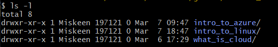
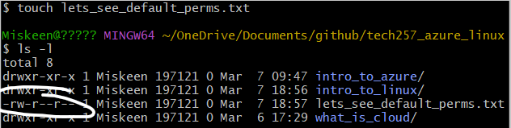
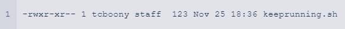
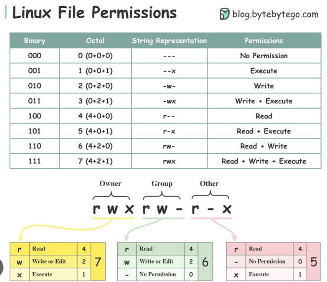

# Linux File Ownership
## Managing file ownership
1. Managing file ownership is crucial for security and access control, ensuring only authorized users can modify or access specific files or directories.
2. The command to view file ownership is `ls -l`, which displays detailed information including the owner and group of files and directories.
   
3. When a user creates a file or directory, the permissions are typically set to allow the user full access (read, write, execute), and the file or directory belongs to the user who created it.
4. The owner does not receive execute (X) permissions by default when creating a file to prevent accidental execution of potentially harmful scripts or programs.

5. The command used to change the owner of a file or directory is `chown`, followed by the new owner's username and the name of the file or directory. `chown <new-user> <file-name>` then do `ls -l` to confirm changes.
## Managing file permissions

1. Being the owner of a file does not necessarily mean you have full permissions on that file. By default an owner may only get read and write permissions to a file and not execute, this is best practice - The principle of least privilege states that identities should only be permitted to perform the smallest set of actions necessary to fulfill a specific task

2. Granting specific access rights to the user who owns the file or directory. Basically what the owner can do.

3. Providing access rights to a designated group of users. Members of the group to which the file or directory belongs will have the specified permissions, independent of their individual user permissions.

4. Allowing access to all users who are not the owner or members of the designated group. These permissions apply globally to all users who do not fall into the User or Group categories.

5. If the file's permissions are set as described (User: read-only, Group: read and write, Other: read, write, and execute), as the owner logged in, you would have read-only permissions on the file. Even though you own the file, your permissions are restricted to read-only based on the User permissions set.

6. The file "keeprunning.sh" has the following permissions:
     
   - Owner: read, write, execute `rwx`
   - Group: read, execute `r-x`
   - Other: read only `r--`
   Additionally, it is owned by user `tcboony` and belongs to the group `staff`. The file size is 123 bytes, and it was last modified on Nov 25 at 18:36.

## Managing file permissions using numeric values

1. Read: 4 | Write: 2 | Execute: 1

2. Assigning read and write permissions would be  6 (4 for read + 2 for write).

3. Assigning read, write, and execute permissions would be 7 (4 for read + 2 for write + 1 for execute).

4. Assigning read and execute permissions would be 5 (4 for read + 1 for execute).

5. 
   - The owner has read and write permissions (6).
   - The group has read-only permissions (4).
   - Others have read-only permissions (4).
    So, in total, it means the owner can read and modify the file, while the group and others can only read it.

## Changing file permissions
1. To change file permissions use `chmod`

2. To change permissions on a file, the end user must either be the owner of the file or have appropriate permissions granted by the owner. Alternatively, the user must have superuser privileges (root access).

3. Examples of setting permissions on a new file named "testfile.txt": 
   a. `chmod u=r,g=rwx,o=rw testfile.txt` 
   b. `chmod +x testfile.txt` 
   c. `chmod g-w testfile.txt` 
   d. `chmod 640 testfile.txt`