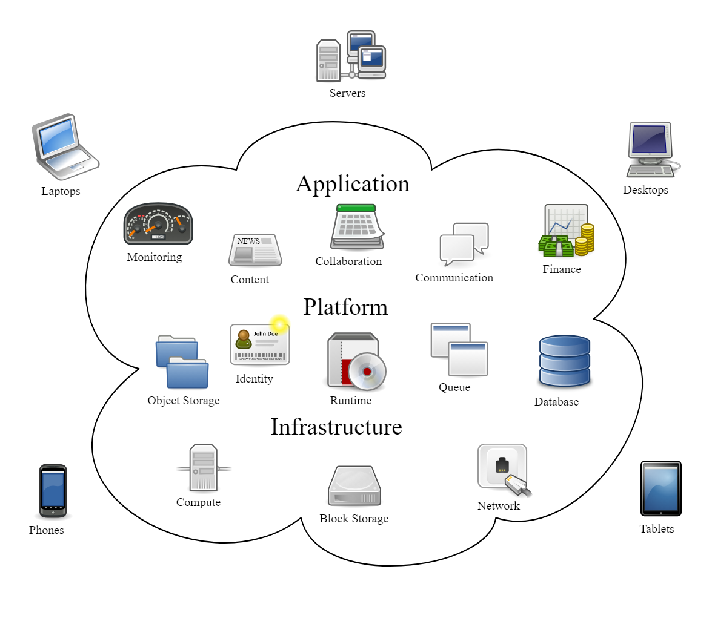
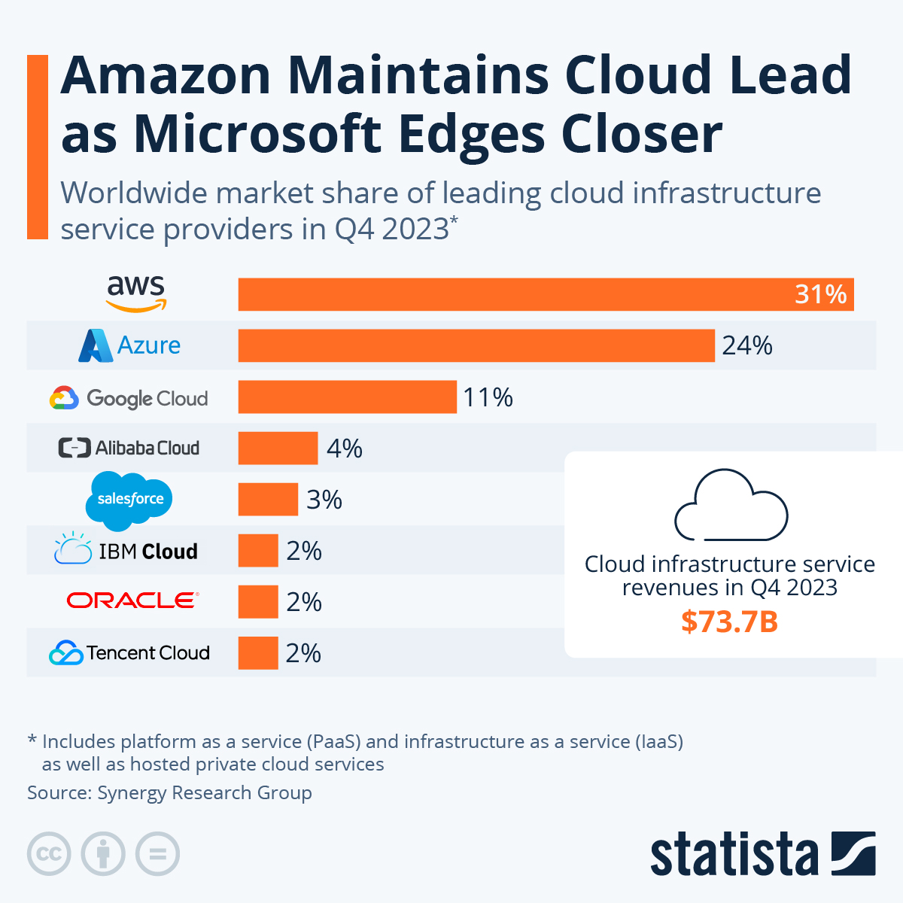

# Cloud Computing Basics

## What is Cloud Computing?
Cloud computing refers to the delivery of computing services (such as servers, storage, databases, networking, software, analytics, and intelligence) over the internet ("the cloud") to offer faster innovation, flexible resources, and economies of scale.  
This could be simplified to anything that involves delivering services over the internet as opposed to hardware or software installations on devices, it's somewhere else, on-demand and centrally managed.

## Quick History/Timeline of Cloud Computing:
Cloud computing emerged in the early 2000s when companies began offering virtualized infrastructure and storage services over the internet. Key milestones include the launch of Amazon Web Services (AWS) in 2006, followed by Google Cloud Platform (GCP) and Microsoft Azure in subsequent years.

## What Can You Do with Cloud Computing?
With cloud computing, individuals and businesses can:
- Store and access data from anywhere with an internet connection.
- Host websites and applications without the need for physical servers.
- Scale resources up or down based on demand.
- Run complex computations and analytics.
- Collaborate on projects in real-time.
- Implement disaster recovery and backup solutions.

## What are the 4 Types/Models of Cloud?
The four types/models of cloud are:
- **Public Cloud**: Cloud services offered by third-party providers over the internet, available to the general public. **Main difference**: Resources are shared among multiple users and accessible via the internet.
- **Private Cloud**: Cloud infrastructure operated solely for a single organization, either on-premises or by a third-party provider. **Main difference**: Offers dedicated resources and greater control over security and compliance.
- **Hybrid Cloud**: Combination of public and private cloud environments, allowing data and applications to be shared between them. **Main difference**: Provides flexibility to leverage the benefits of both public and private clouds while maintaining control over sensitive data.
- **Multi-Cloud**: Strategy of using multiple cloud providers to meet various business needs, reduce dependency on a single provider, and optimize performance and cost. **Main difference**: Involves distributing workloads across multiple cloud environments to avoid vendor lock-in and increase resilience.

## What are the Different Types of Cloud Service?
The main types of cloud services are:
- **Infrastructure as a Service (IaaS)**: Provides virtualized computing resources over the internet, including virtual machines, storage, and networking. **Main difference**: Offers more control over the infrastructure compared to other services.

- **Platform as a Service (PaaS)**: Offers a platform allowing developers to build, deploy, and manage applications without worrying about infrastructure details. **Main difference**: Focuses on application development and deployment, abstracting away underlying infrastructure concerns.

- **Software as a Service (SaaS)**: Delivers software applications over the internet on a subscription basis, eliminating the need for installation and maintenance. **Main difference**: Provides fully functional software applications accessible via the internet without the need for local installation.

## Advantages/Disadvantages of the Cloud? Specifically for a Business:
## Advantages of Cloud Computing:
- **Cost Savings**: Cloud computing eliminates the need for upfront investments in hardware and infrastructure, reducing capital expenditure.
- **Scalability**: Cloud resources can be scaled up or down quickly and easily to meet changing demand.
- **Flexibility**: Cloud services offer flexibility to access data and applications from anywhere with an internet connection.
- **Accessibility**: Cloud-based applications and data can be accessed from any device with an internet connection, enhancing accessibility and collaboration.

## Disadvantages of Cloud Computing:
- **Security Concerns**: Storing data and applications on third-party servers raises security and privacy concerns, including data breaches and regulatory compliance.
- **Dependence on Internet Connection**: Cloud services rely on internet connectivity, leading to potential downtime and disruptions if internet access is lost.
- **Potential Downtime**: Cloud service outages or maintenance can result in downtime, impacting business operations and productivity.

## What is OpEx vs CapEx?
OpEx (Operational Expenditure) refers to ongoing operational expenses incurred to run a business, while CapEx (Capital Expenditure) refers to one-time investments in physical assets.

## Marketshare - What is the Breakdown?
The cloud computing market is dominated by AWS, followed by Microsoft Azure and Google Cloud Platform (GCP).

## What are the 3 Largest Cloud Providers Known for?
- AWS: Vast array of services and global infrastructure.
- Azure: Integration with Microsoft products and services.
- GCP: Expertise in data analytics and machine learning.

## What are the 4 Pillars of DevOps? How do They Link into the Cloud?
The four pillars of DevOps:
### 1. Culture:
- **Description**: DevOps culture emphasizes collaboration, communication, and shared responsibility among development, operations, and other stakeholders.
- **Importance**: Encourages a cultural shift towards continuous improvement, innovation, and teamwork, fostering a conducive environment for DevOps practices.

### 2. Automation:
- **Description**: Automation involves automating repetitive tasks, processes, and workflows to streamline development, deployment, testing, and operations.
- **Importance**: Reduces manual errors, accelerates delivery, enhances consistency, and frees up human resources for more strategic tasks.

### 3. Measurement:
- **Description**: Measurement involves collecting, analyzing, and interpreting data to monitor progress, identify bottlenecks, and make informed decisions.
- **Importance**: Provides visibility into the DevOps process, enables continuous feedback and improvement, and helps align efforts with business objectives.

### 4. Sharing:
- **Description**: Sharing emphasizes knowledge sharing, collaboration, and transparency across teams, departments, and organizations.
- **Importance**: Facilitates cross-functional collaboration, fosters a culture of learning and innovation, and promotes the reuse of best practices and resources.

These four pillars form the foundation of DevOps practices, guiding organizations towards achieving agility, efficiency, and resilience in software delivery and operations.

## Case Studies Showing Businesses Migrating to or Using the Cloud:
- [Netflix](https://aws.amazon.com/solutions/case-studies/netflix/) - migrated its entire infrastructure to AWS, allowing it to scale globally and handle millions of streaming requests.
- [Airbnb](https://cloud.google.com/customers/airbnb) - leverages Google Cloud Platform to manage its massive data volumes, enabling personalized user experiences and efficient operations.
- [Slack](https://slack.engineering/rebuilding-slack-on-the-desktop-308d6fe94ae4) - moved its desktop application to AWS, resulting in improved performance, reliability, and scalability.

## How Does Cloud Computing Work as a Business Model?
Cloud computing operates on a pay-as-you-go model, where businesses only pay for the resources and services they use, allowing for cost-effective scalability and flexibility.

## What Sorts of Things Do You Usually Need to Pay for When Using the Cloud?
Businesses typically pay for:
- Virtual servers
- Storage space
- Data transfer
- Compute power
- Software licenses
- Support services
